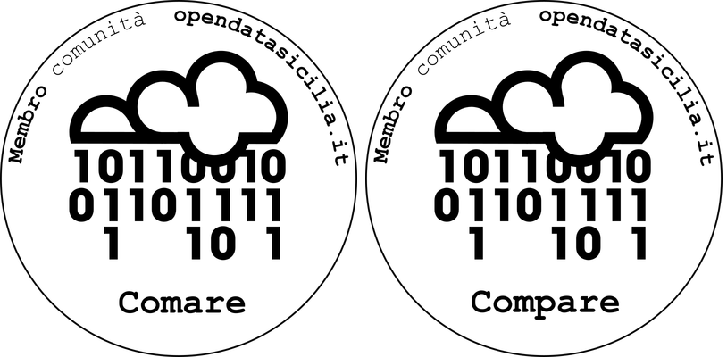

# Breve descrizione

Questa cartella contiene un *communication kit* per Open Data Sicilia:

* il logo - "logo opendatasicilia.svg" - composto da un'icona di pubblico dominio e da un testo in carattere Courier New;
* un'immagine in CC-By usata come sfondo in molti nostri spazi - "sfondo opendatasicilia.jpg" - che è di [Salvatore Ciambra](https://www.flickr.com/photos/vater_fotografo/)
* i loghi - "[logo opendatasicilia compare membro di ods.svg](https://github.com/SiciliaHub/opendatasicilia-blog/blob/master/communication%20kit/logoOpendatasiciliaComare_membro_ODS.svg)" e "[logo opendatasicilia compare membro ods.svg](https://github.com/SiciliaHub/opendatasicilia-blog/blob/master/communication%20kit/logoOpendatasiciliaCompare_membro_ODS.svg)" - composto dal logo opendatasicilia e da testi che descrivono l'appartenenza alla comunità;

* una presentazione della comunità.
